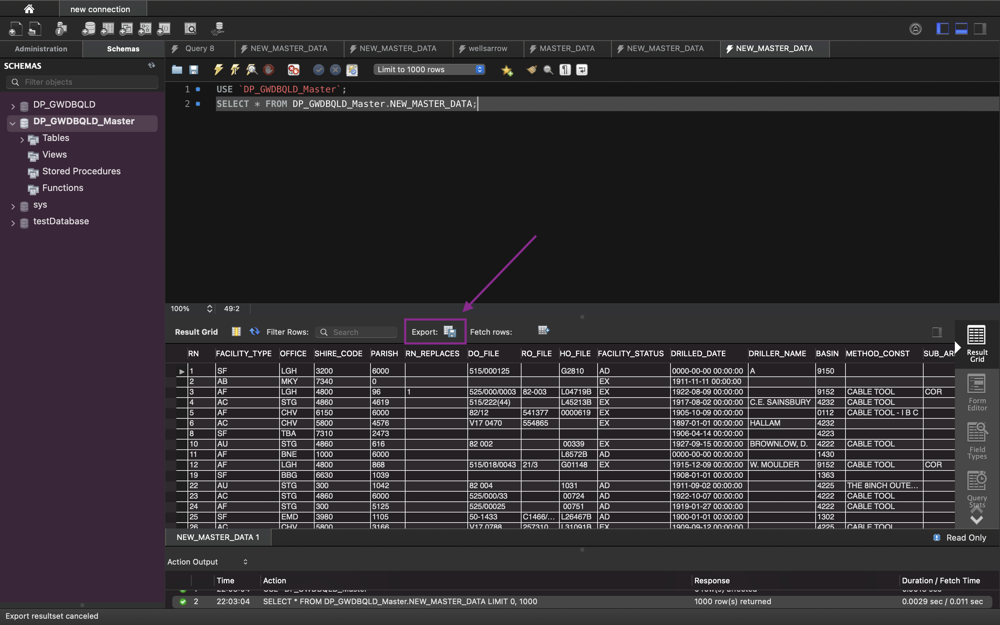

# How to enforce consistency in Facility Names in the Arrow Energy and Queensland GW Database

Charles Chaaya suggested that we replace all dashes ```-``` with spaces ```" "```. Steve also suggested that I replace all underscores ```_``` with spaces, and lastly, upon visual inspection, I replaced ```???``` with spaces and removed unnecessary asterisks ```*```.


# ENFORCING DATA CONSISTENCY IN THE QUEENSLAND GW DATABASE (MASTER_DATA table)

I have quite a substantial amount of experience with data manipulation in python, so I decided that instead of using SQL, I'll use python instead. The solution to the problem aforementioned is outlined in the steps below;

1. Create a new table called NEW_MASTER_TABLE using the SQL code below. A new table is created because I did not want to make changes the **MASTER_DATA** table. The code replaces all dashes (```-```) with spaces (```" "```) in the **ORIG_NAME_NO** as requested by Charles Chaaya. The **ORIG_NAME_NO** column is renamed to **CONSISTENT_ORIG_NAME_NO**.

```sql
USE `DP_GWDBQLD_Master`;

-- MODIFYING THE DRILLED_DATE AND LOG_RECEVIED_DATE COLUMN; Because it contains some invalid datetime values
ALTER TABLE MASTER_DATA MODIFY COLUMN DRILLED_DATE VARCHAR(30), MODIFY COLUMN LOG_RECEIVED_DATE VARCHAR(30);

CREATE TABLE NEW_MASTER_DATA 
SELECT RN, FACILITY_TYPE, OFFICE, SHIRE_CODE, PARISH, RN_REPLACES, DO_FILE, RO_FILE, HO_FILE, FACILITY_STATUS, DRILLED_DATE, DRILLER_NAME, BASIN, METHOD_CONST, SUB_AREA, LOT, PLAN, DESCRIPTION, COUNTY, LAT, LNG, EASTING, NORTHING, ZONE, ACCURACY, GPS_ACCURACY, GIS_LAT, GIS_LNG, CHECKED, MAP_SCALE, MAP_SERIES, MAP_NO, PROG_SECT, EQUIPMENT, REPLACE(ORIG_NAME_NO, "-", " ") as CONSISTENT_ORIG_NAME_NO, POLYGON, CONFIDENTIAL, DATA_OWNER, BORE_LINE_CODE, DRILLER_LICENCE_NUMBER, LOG_RECEIVED_DATE, OBJECTID
FROM DP_GWDBQLD_Master.MASTER_DATA;
``` 

2. To the extent of my knowledge in SQL, replacing ```??```, ```*```, etc. requires a few subqueries. Since I'm more productive with python, I decided to use that instead. 

Firstly, the data in the **NEW_MASTER_DATA** table is exported in a CSV format using the following steps;
- Remove the limit on the number of rows that can be displayed in the workbench


<br/>

- Run the following SQL code. It simply selects all the data in the **New Master Data** table.

```sql
-- This database should now contain the New Master data table
USE `DP_GWDBQLD_Master`;

-- Select everything from the New Master data table
SELECT * FROM DP_GWDBQLD_Master.NEW_MASTER_DATA;
```

- Export the selection in a CSV format.


Make sure to name the CSV file as **Consistent Names.csv**.


- The **New Master Data** table is now in CSV format. Use the following python script to remove all unnecessary characters.
```python
import pandas as pd 
pd.set_option('display.max_columns', None)

# Read in 
consistent_names = pd.read_csv("Consistent Names.csv")

# Remove ******
consistent_names["CONSISTENT_ORIG_NAME_NO"] = consistent_names["CONSISTENT_ORIG_NAME_NO"].str.replace("REPEALED ***********", "REPEALED", regex=False)

# Remove ??
consistent_names["CONSISTENT_ORIG_NAME_NO"] = consistent_names["CONSISTENT_ORIG_NAME_NO"].str.replace("??", "", regex=False)

# Replace underscores with spaces
consistent_names["CONSISTENT_ORIG_NAME_NO"] = consistent_names["CONSISTENT_ORIG_NAME_NO"].str.replace("_", " ", regex=False)

# Replace dashes with spaces
consistent_names["CONSISTENT_ORIG_NAME_NO"] = consistent_names["CONSISTENT_ORIG_NAME_NO"].str.replace("-", " ", regex=False)

# Save the cleaned file
consistent_names.to_csv("Consistent Names.csv", index=False)
```


# ENFORCING DATA CONSISTENCY IN THE ARROW ENERGY WELLS DATA

1. The Arrow Energy wells data has to be imported into the ```DP_GWDBQLD_Master``` database. This is done using the **Table Data Import Wizard** as shown in the screen capture below.


The import wizard does not work with excel files, so the Arrow energy excel file will have to be converted into CSV format. In this case, the name of the CSV file is **WELLSArrow.csv**.

<br/>

2. Remove all unecessary characters using the python script below.

```python
import pandas as pd
arrow_wells = pd.read_csv("WELLSArrow.csv")

# Remove ******
arrow_wells["Well Name"] = arrow_wells["Well Name"].str.replace("REPEALED ***********", "REPEALED", regex=False)

# Remove ??
arrow_wells["Well Name"] = arrow_wells["Well Name"].str.replace("??", "", regex=False)

# Replace underscores with spaces
arrow_wells["Well Name"] = arrow_wells["Well Name"].str.replace("_", " ", regex=False)

# Replace dashes with spaces
arrow_wells["Well Name"] = arrow_wells["Well Name"].str.replace("-", " ", regex=False)

# Save the cleaned file
arrow_wells.to_csv("WELLSArrow.csv", index=False)
```